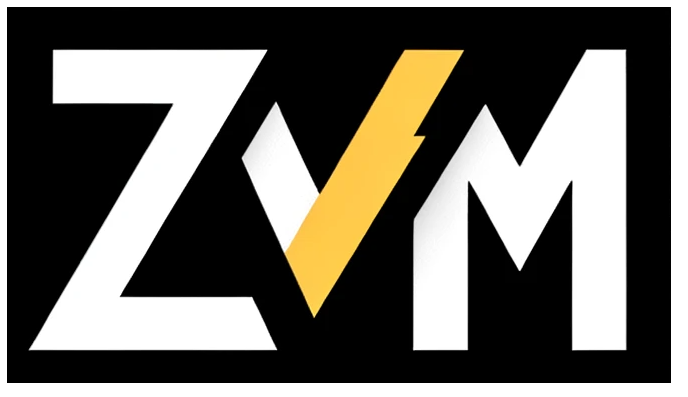

<h1 align="center">
   
  <br><br>
  ⚡ Zig Version Manager (<code>zvm</code>)
</h1>
<div align="center">⚡ Fast and simple zig version manager
<br></br>

[](LICENSE)
[](https://github.com/hendriknielaender/zvm/actions/workflows/zig.yml)
[](https://github.com/hendriknielaender/zvm/releases)

</div>

**zvm** is a fast, native command-line version manager for the [Zig programming language](https://ziglang.org/). It installs Zig and ZLS releases, switches active versions, detects project requirements from `build.zig.zon`, and keeps automation predictable with JSON/plain output, non-interactive modes, timeouts, and safe cleanup.

## ✨ Highlights

- Manage Zig and ZLS from one CLI: install, use, list, remove, and clean both toolchains.
- Project-aware shims automatically detect `minimum_zig_version` from `build.zig.zon`.
- Safer destructive commands: removing the active version and `clean --all` ask for confirmation unless `--yes` is passed.
- Automation-friendly output: `--json`, `--plain`, `--quiet`, `--no-input`, and predictable exit behavior.
- Better terminal behavior: color honors `NO_COLOR`, progress output is disabled when stdout is not a TTY, and interrupted installs clean up partial files.
- Resilient downloads with per-mirror timeouts and mirror fallback.

## 📦 Installation

#### macOS/Linux (Homebrew)
```shell
brew tap hendriknielaender/zvm
brew install zvm
```

Pre-built binaries for Windows, MacOS, and Linux are available [for each release](https://github.com/hendriknielaender/zvm/releases/latest).

### Quick Install (Linux/macOS)

```sh
curl -fsSL https://raw.githubusercontent.com/hendriknielaender/zvm/main/install.sh | bash
```

**Install specific version or rollback:**
```sh
# Install specific version
curl -fsSL https://raw.githubusercontent.com/hendriknielaender/zvm/main/install.sh | bash -s "v0.21.0"

# Rollback to previous version
curl -fsSL https://raw.githubusercontent.com/hendriknielaender/zvm/main/install.sh | bash -s "v0.20.0"

# Also works with 'zvm-' prefix
curl -fsSL https://raw.githubusercontent.com/hendriknielaender/zvm/main/install.sh | bash -s "zvm-v0.21.0"
```

The installer will download the appropriate binary for your platform and install it to `~/.local/bin`. Make sure this directory is in your PATH.

#### Windows (PowerShell)
```powershell
irm https://raw.githubusercontent.com/hendriknielaender/zvm/master/install.ps1 | iex
```

**Install specific version or rollback:**
```powershell
# Pass a version through the script block
& ([scriptblock]::Create((irm https://raw.githubusercontent.com/hendriknielaender/zvm/master/install.ps1))) -Version "v0.21.0"

# Or set ZVM_VERSION before piping to iex
$env:ZVM_VERSION = "v0.21.0"; irm https://raw.githubusercontent.com/hendriknielaender/zvm/master/install.ps1 | iex
```

#### Manual Installation
Download the latest binary from our [releases page](https://github.com/hendriknielaender/zvm/releases).

### Setup Your Shell

After installation, configure your shell environment:

```bash
# Get shell-specific configuration
zvm env

# Example output on Unix shells:
# Add this to your ~/.bashrc, ~/.profile, or ~/.zshrc:
export PATH="$HOME/.local/share/.zm/bin:$PATH"
```

You can also ask for a specific shell:

```bash
zvm env --shell=zsh
zvm env --shell=fish
zvm env --shell=powershell
```

---

## 📖 Usage Guide

### Core Commands

| Command | Description | Example |
|---------|-------------|---------|
| `install`, `i` | Install a Zig or ZLS version | `zvm install 0.16.0` |
| `use`, `u` | Switch to a Zig or ZLS version | `zvm use 0.16.0` |
| `list`, `ls` | List installed versions | `zvm list --all` |
| `list-remote` | List available Zig or ZLS versions | `zvm list-remote --zls` |
| `remove`, `rm` | Remove an installed version | `zvm --yes remove 0.15.2` |
| `clean` | Clean cache and unused versions | `zvm clean --all` |
| `upgrade` | Upgrade zvm itself | `zvm upgrade` |

Common aliases are available for everyday commands:

```bash
zvm i 0.16.0       # install
zvm u 0.16.0       # use
zvm ls --all       # list
zvm rm 0.15.2      # remove
```

### 🎯 Auto-version detection

Automatically detects the required Zig version from your project's `build.zig.zon` file.

Create a `build.zig.zon` in your project root:
```zig
.{
    .name = "my-project",
    .version = "0.1.0",
    .minimum_zig_version = "0.16.0",
    .dependencies = .{},
}
```

Now simply run `zig build` or any Zig command - zvm will:
1. 🔍 Detect the required version from `build.zig.zon`
2. 📦 Automatically install it if not present  
3. 🎯 Use the correct version for your project

```bash
# zvm automatically detects and uses the right version
zig build
zig run src/main.zig
# Or specify version explicitly
zig 0.16.0 build
```

### Installation Examples

```bash
# Install a stable Zig release
zvm install 0.16.0

# Install quietly (errors only)
zvm --quiet install 0.16.0

# Install master/development build
zvm install master

# Install ZLS (Language Server)
zvm install --zls 0.16.0

# Inspect available ZLS releases before installing
zvm list-remote --zls
```

### Version Management

```bash
# Switch to specific version
zvm use 0.16.0

# List installed versions
zvm list

# List installed Zig and ZLS versions together
zvm list --all

# List all available versions
zvm list-remote

# Remove old version
zvm remove 0.15.2

# Remove without prompting, useful in automation
zvm --yes remove 0.15.2

# Clean up download cache
zvm clean

# Remove cached artifacts and every non-current Zig/ZLS version
zvm clean --all
```

### Advanced Usage

```bash
# JSON output for automation
zvm --json list

# Plain table output for shell pipelines
zvm --plain list

# Quiet mode (errors only)
zvm --quiet install master

# Verbose diagnostics on stderr
zvm --verbose install 0.16.0

# Trace HTTP/file-path details while debugging downloads
zvm --trace install master

# Non-interactive runs fail instead of prompting
zvm --no-input clean --all

# Force colored output
zvm --color list

# Disable colored output
zvm --no-color list

# List available download mirrors
zvm list-mirrors

# Upgrade zvm itself
zvm upgrade

# Show command-specific help
zvm help list
zvm list --help

# Use attached long-option values
zvm env --shell=zsh

# Show the zvm version
zvm --version

# End option parsing explicitly
zvm -- list
```

---

## 🔧 Configuration

### Global Options

| Flag | Description |
|------|-------------|
| `--json` | Output in JSON format |
| `--plain` | Tabular output for shell pipelines, without headers or color |
| `--quiet` | Suppress non-error output |
| `--verbose` | Show debug output on stderr |
| `--trace` | Show trace output with HTTP details and file paths |
| `--no-color` | Disable colored output |
| `--color` | Force colored output |
| `--yes` | Skip confirmation prompts for destructive operations |
| `--no-input` | Refuse to prompt; non-interactive runs fail fast |
| `--help`, `-h` | Show help |
| `--version` | Show version |

### Environment Variables

| Variable | Description | Default |
|----------|-------------|---------|
| `ZVM_HOME` | Override the zvm install/data directory | Platform-specific user data directory |
| `XDG_DATA_HOME` | Base data directory on Unix when `ZVM_HOME` is unset | `~/.local/share` |
| `ZVM_DEBUG` | Legacy alias for verbose logging | `false` |
| `NO_COLOR` | Disable colored output when set | unset |
| `ZVM_DOWNLOAD_TIMEOUT_SECONDS` | Per-mirror download timeout, with mirror fallback | `1800` |

---

## 🌟 Shell Completions

Enhance your CLI experience with tab completion!

### Bash
```bash
# Generate and install completion
zvm completions bash > /etc/bash_completion.d/zvm
source ~/.bashrc
```

### Zsh
```bash
# Generate completion script
zvm completions zsh > ~/.zsh/completions/_zvm

# Add to ~/.zshrc
fpath+=(~/.zsh/completions)
autoload -U compinit && compinit
```

### Fish
```bash
# Generate completion for Fish
zvm completions fish > ~/.config/fish/completions/zvm.fish
```

---

## 🏗️ Building from Source

### Prerequisites
- Zig 0.16.0 or later

### Build Steps
```bash
git clone https://github.com/hendriknielaender/zvm.git
cd zvm
zig build -Doptimize=ReleaseSafe
```

---

## 🐛 Troubleshooting

### Common Issues

**PATH not updated after installation**
- Follow [Setup Your Shell](#setup-your-shell), then restart or reload your shell.

**Version detection not working**
- Ensure `build.zig.zon` contains `minimum_zig_version` field
- Check file is in project root or parent directories

---

## 🤝 Contributing

We welcome contributions! Please see our [Contributing Guidelines](CONTRIBUTING.md) for details.

### Development Setup
```bash
git clone https://github.com/hendriknielaender/zvm.git
cd zvm
zig build test
```
---

## 📄 License

This project is licensed under the MIT License - see the [LICENSE](LICENSE) file for details.

---

### ⚠️ Disclaimer

This project is **not** affiliated with the [ZVM project](https://github.com/tristanisham/zvm) maintained by @tristanisham. Both projects operate independently, and any similarities are coincidental.
