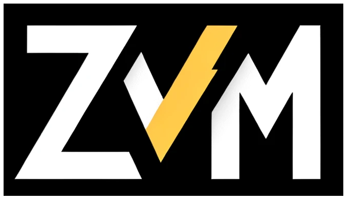

<h1 align="center">
   
  <br><br>
  ⚡ Zig Version Manager (<code>zvm</code>)
</h1>
<div align="center">⚡ Fast and simple zig version manager
<br></br>

[](LICENSE)
[](https://github.com/hendriknielaender/zvm/actions/workflows/zig.yml)
[](https://github.com/hendriknielaender/zvm/releases)

</div>

**zvm** is a blazingly fast and intuitive command-line version manager for the [Zig programming language](https://ziglang.org/). Effortlessly install, manage, and switch between multiple Zig versions with automatic project-based version detection.

## 📦 Installation

#### macOS/Linux (Homebrew)
```shell
brew tap hendriknielaender/zvm
brew install zvm
```

Pre-built binaries for Windows, MacOS, and Linux are available [for each release](https://github.com/hendriknielaender/zvm/releases/latest).

### Quick Install (Linux/macOS)

```sh
curl -fsSL https://raw.githubusercontent.com/hendriknielaender/zvm/main/install.sh | bash
```

**Install specific version or rollback:**
```sh
# Install specific version
curl -fsSL https://raw.githubusercontent.com/hendriknielaender/zvm/main/install.sh | bash -s "v0.15.0"

# Rollback to previous version
curl -fsSL https://raw.githubusercontent.com/hendriknielaender/zvm/main/install.sh | bash -s "v0.14.0"

# Also works with 'zvm-' prefix
curl -fsSL https://raw.githubusercontent.com/hendriknielaender/zvm/main/install.sh | bash -s "zvm-v0.15.0"
```

The installer will download the appropriate binary for your platform and install it to `~/.local/bin`. Make sure this directory is in your PATH.

#### Windows (PowerShell)
```powershell
irm https://raw.githubusercontent.com/hendriknielaender/zvm/master/install.ps1 | iex
```

#### Manual Installation
Download the latest binary from our [releases page](https://github.com/hendriknielaender/zvm/releases).

### Setup Your Shell

After installation, configure your shell environment:

```bash
# Get shell-specific configuration
zvm env

# Example output:
# Add this to your ~/.bashrc, ~/.profile, or ~/.zshrc:
export PATH="/home/user/.local/share/zvm/bin:$PATH"
```

---

## 📖 Usage Guide

### Core Commands

| Command | Description | Example |
|---------|-------------|---------|
| `install` | Install a Zig version | `zvm install 0.13.0` |
| `use` | Switch to a version | `zvm use 0.13.0` |
| `list` | List installed versions | `zvm list --system` |
| `list-remote` | List available versions | `zvm list-remote` |
| `remove` | Remove a version | `zvm remove 0.12.0` |
| `clean` | Clean up cache | `zvm clean` |

### 🎯 Auto-version detection

Automatically detects the required Zig version from your project's `build.zig.zon` file.

Create a `build.zig.zon` in your project root:
```zig
.{
    .name = "my-project",
    .version = "0.1.0",
    .minimum_zig_version = "0.13.0",
    .dependencies = .{},
}
```

Now simply run `zig build` or any Zig command - zvm will:
1. 🔍 Detect the required version from `build.zig.zon`
2. 📦 Automatically install it if not present  
3. 🎯 Use the correct version for your project

```bash
# zvm automatically detects and uses the right version
zig build
zig run src/main.zig
# Or specify version explicitly
zig 0.13.0 build
```

### Installation Examples

```bash
# Install latest stable Zig
zvm install 0.13.0

# Install with debug output
zvm install 0.13.0 --debug

# Install master/development build
zvm install master

# Install ZLS (Language Server)
zvm install zls 0.13.0

# Use specific mirror for downloads
zvm install 0.13.0 --mirror=0
```

### Version Management

```bash
# Switch to specific version
zvm use 0.13.0

# List installed versions
zvm list --system

# List all available versions
zvm list-remote

# Remove old version
zvm remove 0.12.0

# Clean up download cache
zvm clean
```

### Advanced Usage

```bash
# JSON output for automation
zvm --json list

# Quiet mode (errors only)
zvm --quiet install master

# Force colored output
zvm --color list

# List available download mirrors
zvm list-mirrors
```

---

## 🔧 Configuration

### Global Options

| Flag | Description |
|------|-------------|
| `--json` | Output in JSON format |
| `--quiet`, `-q` | Suppress non-error output |
| `--no-color` | Disable colored output |
| `--color` | Force colored output |
| `--help`, `-h` | Show help |
| `--version` | Show version |

### Environment Variables

| Variable | Description | Default |
|----------|-------------|---------|
| `XDG_DATA_HOME` | Data directory location | `~/.local/share` |
| `ZVM_DEBUG` | Enable debug logging | `false` |

---

## 🌟 Shell Completions

Enhance your CLI experience with tab completion!

### Bash
```bash
# Generate and install completion
zvm completions bash > /etc/bash_completion.d/zvm
source ~/.bashrc
```

### Zsh
```bash
# Generate completion script
zvm completions zsh > ~/.zsh/completions/_zvm

# Add to ~/.zshrc
fpath+=(~/.zsh/completions)
autoload -U compinit && compinit
```

### Fish
```bash
# Generate completion for Fish
zvm completions fish > ~/.config/fish/completions/zvm.fish
```

---

## 🏗️ Building from Source

### Prerequisites
- Zig 0.15.1 or later

### Build Steps
```bash
git clone https://github.com/hendriknielaender/zvm.git
cd zvm
zig build -Doptimize=ReleaseSafe
```

---

## 🐛 Troubleshooting

### Common Issues

**PATH not updated after installation**
```bash
# Re-run shell configuration
zvm env
source ~/.bashrc  # or ~/.zshrc
```

**Version detection not working**
- Ensure `build.zig.zon` contains `minimum_zig_version` field
- Check file is in project root or parent directories

---

## 🔄 Migration Guide

### From v0.13.x to v0.15.x

**⚠️ BREAKING CHANGE**: zvm now follows XDG Base Directory Specification on Linux/macOS.

**Migration Steps:**
```bash
# 1. Backup current installation
cp -r ~/.zm ~/.zm.backup

# 2. Install new version
brew upgrade zvm

# 3. Migrate existing versions (manual)
mkdir -p ~/.local/share/zvm
mv ~/.zm/* ~/.local/share/zvm/

# 4. Update PATH configuration
zvm env >> ~/.bashrc
```

---

## 🤝 Contributing

We welcome contributions! Please see our [Contributing Guidelines](CONTRIBUTING.md) for details.

### Development Setup
```bash
git clone https://github.com/hendriknielaender/zvm.git
cd zvm
zig build test
```
---

## 📄 License

This project is licensed under the MIT License - see the [LICENSE](LICENSE) file for details.

---

### ⚠️ Disclaimer

This project is **not** affiliated with the [ZVM project](https://github.com/tristanisham/zvm) maintained by @tristanisham. Both projects operate independently, and any similarities are coincidental.
